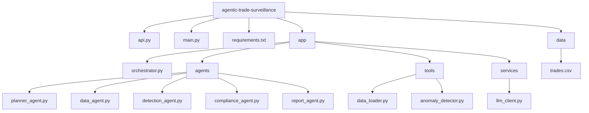

## AIAgent

### Project Architecture



### Project folder structure

```

agentic-trade-surveillance/
│
├── api.py
├── main.py
├── requirements.txt
├── README.md
├── .gitignore
│
├── app/
│   ├── __init__.py
│   ├── orchestrator.py
│   │
│   ├── agents/
│   │   ├── planner_agent.py
│   │   ├── data_agent.py
│   │   ├── detection_agent.py
│   │   ├── compliance_agent.py
│   │   └── report_agent.py
│   │
│   ├── tools/
│   │   ├── data_loader.py
│   │   └── anomaly_detector.py
│   │
│   └── services/
│       └── llm_client.py
│
└── data/
    └── trades.csv
```
### Demo link 

https://aiagent-ln0x.onrender.com


### Demo deployment on reander.com


### Demo run on webbrowser


### Running locally 

```bash
pip install -r requirements.txt
uvicorn api:app --reload
```

### Output Sample shared in screenshots

```bash
Link for getting output
http://127.0.0.1:8000/docs
```

