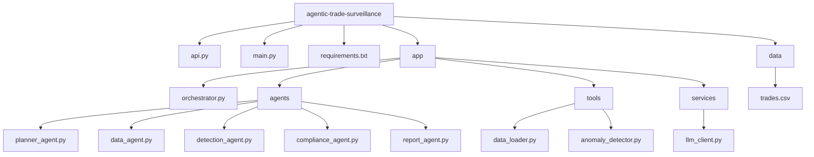

# AIAgent

## Project Architecture



## Project folder structure
```

agentic-trade-surveillance/
│
├── api.py
├── main.py
├── requirements.txt
├── README.md
├── .gitignore
│
├── app/
│   ├── __init__.py
│   ├── orchestrator.py
│   │
│   ├── agents/
│   │   ├── planner_agent.py
│   │   ├── data_agent.py
│   │   ├── detection_agent.py
│   │   ├── compliance_agent.py
│   │   └── report_agent.py
│   │
│   ├── tools/
│   │   ├── data_loader.py
│   │   └── anomaly_detector.py
│   │
│   └── services/
│       └── llm_client.py
│
└── data/
    └── trades.csv
```


